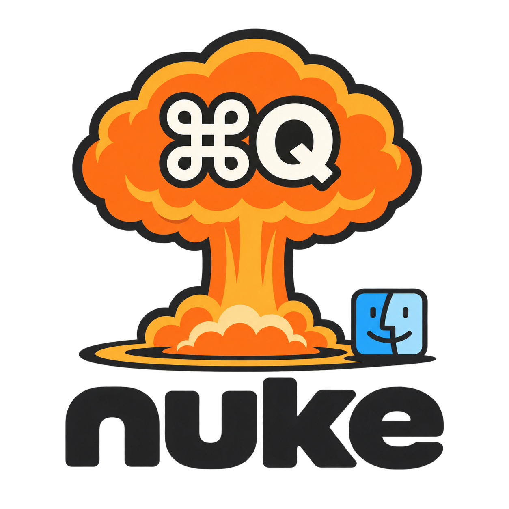

<p align="center">
  
</p>

<h1 align="center">nuke</h1>

<p align="center"><em>Quit every running macOS app from the command line.<br>Nuke it from orbit. It's the only way to be sure.</em></p>

<p align="center">
  <a href="https://github.com/rickhallett/nuke/actions/workflows/ci.yml"></a>
  
  
  <a href="LICENSE"></a>
  
  
  
</p>

---

There's a lovely little menu bar app called *Quit All*. It costs money.
This costs a `cargo build` and comes with a mushroom cloud.

`nuke` talks to AppKit's `NSWorkspace` / `NSRunningApplication` directly —
no AppleScript, no Accessibility permission, no TCC dialog asking whether
your terminal may "control" Calculator. A plain `nuke` is exactly ⌘Q in every
app at once: anything with unsaved changes puts up its own save sheet and
stays open until you deal with it. Anything else is gone.

## Usage

```
nuke                  # ⌘Q every Dock app except the protected ones
nuke -n               # duck and cover: show what would be quit, quit nothing
nuke -l               # list running apps (name, kind, pid, bundle id)
nuke -x Safari,Mail   # leave these standing too
nuke -o Slack,Zoom    # surgical strike: quit only these
nuke -a               # also take out menu-bar / accessory apps
nuke --force-after 10 # ask nicely, then force-quit whatever's left after 10s
nuke -f               # force-quit immediately. Unsaved work is lost. You were warned. Twice, now.
nuke --no-wait        # launch and don't stick around for the fallout
```

Apps can be named by their visible name (case-insensitive) or bundle
identifier (`com.apple.mail`).

### Fallout shelter

Always protected, even with no config:

- **Finder.** It wouldn't quit anyway. It has seen things.
- **Whatever you launched `nuke` from.** It walks up the parent-process chain
  and skips any app it finds there — Ghostty, iTerm, the Cursor terminal,
  whichever — so it never pulls the rug out from under its own shell.

### Exit status

| code | DEFCON | meaning |
|-----:|:------:|---------|
| `0`  | 5 | Everything quit. All clear. |
| `1`  | 3 | Survivors. Something refused, or is still up after the timeout (unsaved changes, usually). |
| `2`  | 1 | Launch codes rejected: the config file didn't parse. |

## Blast radius

`~/.config/nuke/config.toml` (or `$XDG_CONFIG_HOME/nuke/config.toml`):

```toml
# Never quit these unless named explicitly with --only. Names or bundle ids.
keep = ["1Password", "Ghostty", "com.google.Chrome"]

# Seconds to wait for apps to go quietly before reporting them (default 5).
timeout = 5

# Force-quit anything still running after this many seconds. Off by default.
# force_after = 15

# Treat menu-bar apps like Dock apps by default.
include_accessory = false
```

A copy lives in [`config.example.toml`](config.example.toml).

## Ground zero (install)

```
git clone https://github.com/rickhallett/nuke
cd nuke
cargo build --release
cp target/release/nuke ~/.local/bin/
```

Requires macOS and stable Rust. The binary is ~800 KB and has no runtime
dependencies beyond AppKit, which you have, because it's a Mac.

## Notes from the bunker

- `NSRunningApplication.terminated` only updates when a run loop is pumping,
  and a CLI never pumps one. `nuke` asks the kernel (`kill(pid, 0)`) instead.
- Some apps hide a zero-width mark in their own name (looking at you,
  `‎WhatsApp`). `nuke` strips those so `-x WhatsApp` matches the thing you can
  actually see.
- Electron apps count as one app each. `nuke` cannot fix this. Nothing can.

## FAQ

**Does it work on Windows?**
No. Windows already ships a nuke; it's called Windows Update.

**Does it work on Linux?**
Your window manager has probably already got a keybinding for this, and you
have probably already rebound it.

**Is this affiliated with any actual nuclear programme?**
No. Please don't email us. The IAEA has better things to do.

**A strange game. The only winning move is…**
`nuke -n`.

## License

MIT. Now I am become ⌘Q, destroyer of Electron.
